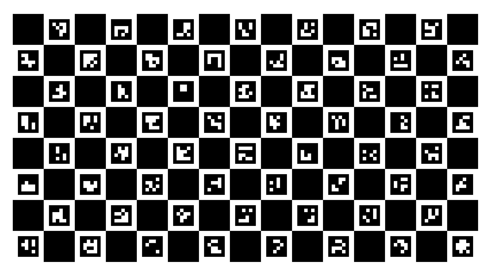

# Grace Eye and Neck Motor Calibration

## Dataset

This file contains the chest camera to left & right eye camera coordinate transform given a set of neck and eyes motor commands from the Grace Robot. Additional data such as the motor angle position from motor encoders and eye camera ray intersections with the planar calibration board in chest camera coordinates are also included.

The setup involves the Grace Robot standing 0.75 meters away from a 8x15 charuco calibration board displayed on a 98-inch TV. The image has a resolution of 3840 x 2160 with a square length of 13.6 cm, and marker length of 9.1 cm. For the gaze pixel of the left and right camera, it is the location of the nose bridge of the user on the eye camera image wherein he/she perceives that the robot is gazing directly at him/her.

The motor commands are uniformly sampled from a combination of:  
* lower neck tilt (deg): {-10,0,10,20,30}
* lower neck pan (deg): {-35,-30,-25,-20,-15,-10,-5,0,5,10,15,20,25,30,35}
* upper neck tilt (deg): {-10,0,10,20,30,40}
* eyes tilt (deg): {-30,-25,-20,-15,-10,-5,0,5,10,15,20}
* left eye pan (deg): {-14,-12,-10,-8,-6,-4,-2,0,2,4,6,8,10,12,14}
* right eye pan (deg): {-14,-12,-10,-8,-6,-4,-2,0,2,4,6,8,10,12,14}

The total dataset contains 1,057,910 samples wherein motor states that yield error status have already been removed.

The dataset is located at `data/intern/0pt75m_grace_dataset.zip`. Extract the zip file to obtain the csv dataset. The columns are:
* x_c_l (meter): the x-axis value of the left eye camera gaze point intersection with charuco board in chest camera coordinates.
* y_c_l (meter): the y-axis value of the left eye camera gaze point intersection with charuco board in chest camera coordinates.
* z_c_l (meter): the z-axis value of the left eye camera gaze point intersection with charuco board in chest camera coordinates.
* x_c_r (meter): the x-axis value of the right eye camera gaze point intersection with charuco board in chest camera coordinates.
* y_c_r (meter): the y-axis value of the right eye camera gaze point intersection with charuco board in chest camera coordinates.
* z_c_r (meter): the z-axis value of the right eye camera gaze point intersection with charuco board in chest camera coordinates.

Pose orientation follows the OpenCV convention; x-axis: positive rightwards, y_axis: positive downwards, z-axis: positive towards the board.

